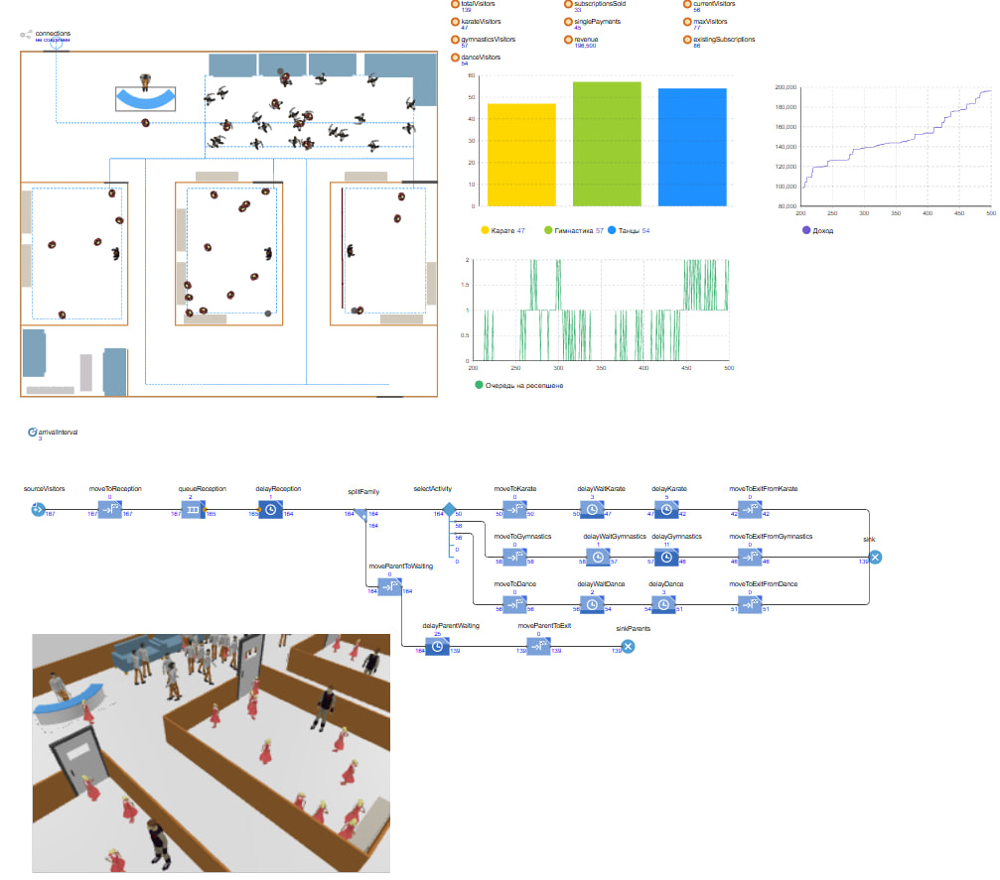

# Имитационная модель детского спортивного комплекса

## О проекте

Проект посвящён разработке и исследованию имитационной модели работы детского спортивного комплекса.

В рамках проекта выполнено моделирование процесса обслуживания посетителей, включая регистрацию на ресепшене, выбор спортивного направления, посещение занятий и выход из системы.

Модель разработана в среде AnyLogic с использованием методов имитационного моделирования и позволяет исследовать влияние нагрузки на основные показатели работы комплекса.

---

## Цель проекта

Разработать имитационную модель детского спортивного комплекса для анализа:

- потока посетителей;
- загрузки ресурсов;
- работы зоны регистрации;
- распределения посетителей между спортивными направлениями;
- эффективности работы системы при различных сценариях нагрузки.

---

## Описание предметной области

Рассматривается работа детского спортивного комплекса в течение рабочего дня.

Основные участники системы:

- ребёнок — основной посетитель спортивных занятий;
- родитель — сопровождает ребёнка и участвует в процессе оплаты;
- сотрудник ресепшена — выполняет регистрацию и оформление посещения.

Основной процесс:
