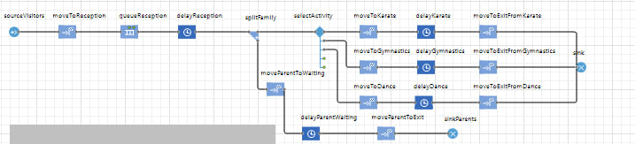
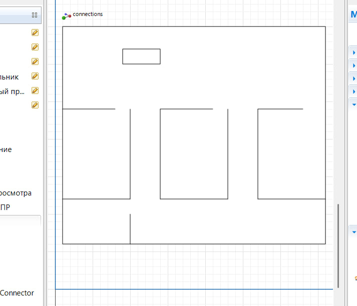
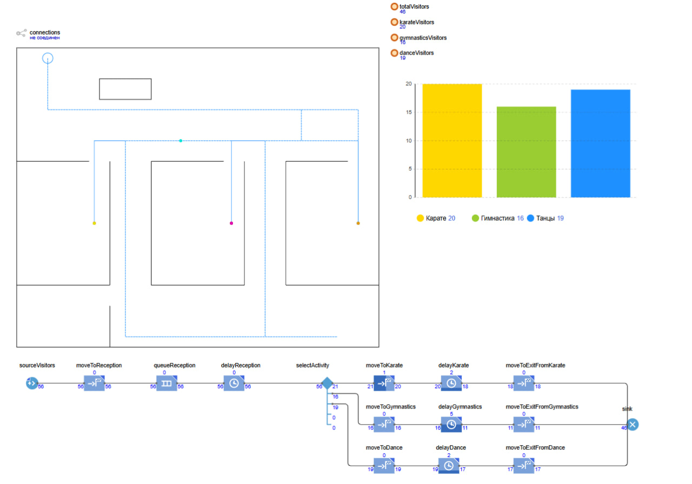
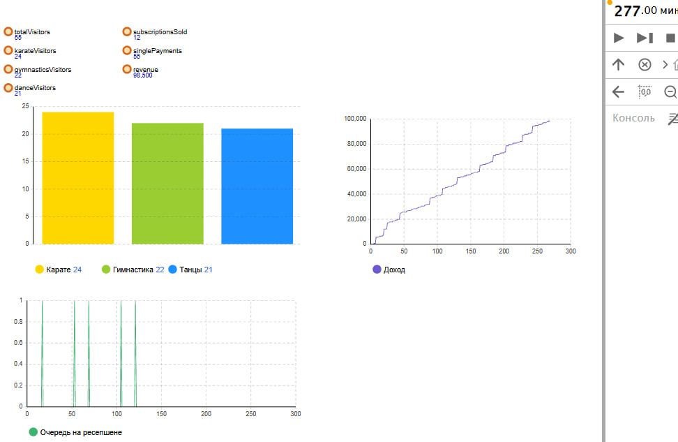

# Имитационная модель детского спортивного комплекса


## О проекте

Проект посвящён разработке и исследованию имитационной модели работы детского спортивного комплекса.

В рамках проекта выполнено моделирование процесса обслуживания посетителей, включая регистрацию на ресепшене, выбор спортивного направления, посещение занятий и выход из системы.

Модель разработана в среде AnyLogic с использованием методов имитационного моделирования и позволяет исследовать влияние нагрузки на основные показатели работы комплекса.

---

## Цель проекта

Разработать имитационную модель детского спортивного комплекса для анализа:

- потока посетителей;
- загрузки ресурсов;
- работы зоны регистрации;
- распределения посетителей между спортивными направлениями;
- эффективности работы системы при различных сценариях нагрузки.

---

## Описание предметной области

Рассматривается работа детского спортивного комплекса в течение рабочего дня.

Основные участники системы:

- ребёнок — основной посетитель спортивных занятий;
- родитель — сопровождает ребёнка и участвует в процессе оплаты;
- сотрудник ресепшена — выполняет регистрацию и оформление посещения.

Основной процесс:

```
Приход посетителя
↓
Регистрация на ресепшене
↓
Оплата / проверка абонемента
↓
Выбор спортивного направления
↓
Посещение занятия
↓
Выход из комплекса

```

---

## Использованные технологии и инструменты

- AnyLogic
- Discrete Event Simulation
- Agent-based Modeling
- 2D/3D Visualization
- Scenario Analysis

---

## Реализованная модель

В модели реализованы:

- входной поток посетителей;
- очередь и обслуживание на ресепшене;
- система оплаты;
- распределение посетителей по спортивным направлениям;
- моделирование длительности занятий;
- учёт количества посетителей внутри комплекса.

---

## Архитектура модели

Логика процесса:



Модель включает следующие основные блоки:

- генерация посетителей;
- перемещение к ресепшену;
- ожидание обслуживания;
- выбор направления занятия;
- посещение спортивных залов;
- завершение процесса.

---

## Визуализация модели

Исходный план комплекса:



Итоговая модель:



---

## Анализ результатов

Для оценки работы системы были реализованы показатели:

- количество посетителей;
- загрузка спортивных направлений;
- очередь на ресепшене;
- накопленный доход;
- максимальное количество посетителей внутри комплекса.

Пример результатов моделирования:



---

## Сценарный эксперимент

Был проведён анализ влияния интенсивности входного потока посетителей на показатели системы.

Изменяемый параметр:

`arrivalInterval`

Рассматривались различные сценарии нагрузки:

- низкая посещаемость;
- стандартная нагрузка;
- повышенный поток посетителей.

Эксперимент позволил оценить изменение:

- длины очередей;
- загрузки помещений;
- количества посетителей;
- финансовых показателей.

---

## Результат проекта

В результате была разработана имитационная модель детского спортивного комплекса, позволяющая исследовать работу системы и выявлять возможные узкие места.

Проект демонстрирует применение методов имитационного моделирования для анализа сложных процессов и оценки эффективности работы системы.

---

## Полученные навыки

В рамках проекта получены навыки:

- анализа предметной области;
- моделирования бизнес-процессов;
- построения имитационных моделей;
- работы с AnyLogic;
- анализа показателей системы;
- проведения сценарных экспериментов;
- визуализации результатов моделирования.
